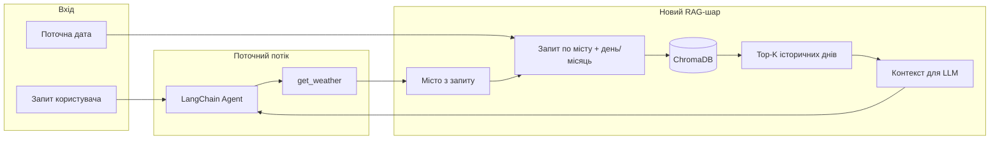

# План: ChromaDB, історична погода та RAGAS-оцінка з LLM-as-judge

## Поточний стан

- **Агент**: [src/weather_agent/agent.py](src/weather_agent/agent.py) — LangChain-агент з одним tool `get_weather(city)`; поточна погода з Open-Meteo; відповідь формується в `ask_agent()`.
- **RAG відсутній**: немає векторного сховища та retrieval.
- **Тести**: pytest (UnitMock, UnitLLM, IntegrationMock, IntegrationLLM, SystemMock, SystemLLM); у IntegrationLLM використовується DeepEval (AnswerRelevancyMetric, ToolCorrectnessMetric).

---

## 1. Датасет для додатку: форма та джерело

### Що потрібно

- Історична погода **за той самий календарний день** (наприклад, 2 березня) за багато років (до 100) для міст, які підтримує агент.
- Формат, зручний для embedding та пошуку: короткі текстові описи типу «2 березня 1925, Київ: макс +5°C, мін -2°C, опади 0 мм, сніг 0 мм» (або еквівалент з датою, містом і основними показниками).

### Рекомендоване джерело: NOAA GHCN-D

- **Global Historical Climatology Network Daily (GHCN-D)** — безкоштовний, публічний, без API-ключа.
- Покриття: понад 100 000 станцій у світі, дані з 1763 року по теперішній час.
- Елементи: **TMAX**, **TMIN** (десятих °C), **PRCP** (десятих мм), **SNOW**, **SNWD** (мм).
- Формат: CSV по роках (наприклад `by_year/2020.csv.gz`) та файл станцій `ghcnd-stations.txt` (ID, lat, lon, name, country тощо).

**Доступ:**

- **AWS**: бакет `noaa-ghcn-pds` (наприклад `s3://noaa-ghcn-pds/csv/by_year/2020.csv.gz`).
- **NOAA**: [https://www1.ncdc.noaa.gov/pub/data/ghcn/daily/](https://www1.ncdc.noaa.gov/pub/data/ghcn/daily/) — `by_year/`, `ghcnd-stations.txt`, `readme.txt` (опис колонок).

**Структура запису GHCN-D (скорочено):**

- `ID` (11 символів), `DATE` (YYYYMMDD), `ELEMENT` (TMAX, TMIN, PRCP, SNOW, SNWD), `VALUE` (число у десятых одиницях для temp/precip).

**Відповідність містам:**

- З `ghcnd-stations.txt` вибрати станції для України (наприклад, по країні або bbox); зіставити міста з геокодування (як у [weather.py](src/weather_agent/weather.py) — Open-Meteo Geocoding) з найближчими станціями GHCN-D за lat/lon.

### Цільова модель даних для RAG

- **Один документ (chunk)** = один календарний день для однієї станції (міста): текст українською для embedding, наприклад:
  - `"2 березня 1985, Київ: температура макс 8.2°C, мін -1.1°C, опади 0 мм, сніг 0 мм."`
- Метадані (для фільтрації в Chroma): `city` (або `station_id`), `month`, `day`, `year` (опційно).
- Індексовані роки: наприклад 1925–2024 для «100 років» (або менше для MVP).

Підсумок: датасет для додатку — це **похідний датасет із GHCN-D**: ETL (завантаження по роках, маппінг станція↔місто, агрегація по день+станція) → текстові chunks → збереження в ChromaDB.

---

## 2. Архітектура: ChromaDB та RAG у потоці агента

**Варіанти інтеграції:**

- **A. Окремий tool** `get_historical_weather(city: str)` — агент сам вирішує, чи викликати; повертає текст «цей день в історії» (наприклад, 3–5 речень з топ-K документів). Плюс: мінімальні зміни в потоці, повторне використання існуючого патерну tools.
- **B. Retrieval до invoke** — у `ask_agent()` перед `agent.invoke()` витягнути місто (наприклад, окремим викликом геокоду або простим NER/ключовими словами), зробити пошук по Chroma за (місто, month, day), додати контекст у system prompt або як додаткове user message. Плюс: завжди є історія для поточного дня; мінус: потрібна логіка витягування міста до виклику агента.

Рекомендація: **варіант A (tool)** для першої ітерації — узгоджується з поточною архітектурою та легко тестується (mock tool).

**Технічні кроки:**

- Додати залежності: `chromadb`, `langchain-chroma` (або `langchain_community` з Chroma), embedding-модель (OpenAI `text-embedding-3-small` або `sentence-transformers` для офлайн).
- Модуль **ETL**: завантаження GHCN-D (по роках), маппінг місто → станція(ї), побудова текстових chunks, запис у Chroma (колекція з metadata: city, month, day).
- Модуль **retrieval**: функція `retrieve_historical_same_day(city: str, month: int, day: int, k: int = 5)` → список рядків або один зведений текст.
- Новий **tool** `get_historical_weather(city: str)` — всередині використовує поточну дату (або дату з контексту) та `retrieve_historical_same_day`, повертає текст українською для вставки в відповідь агента.
- Оновити **system prompt** (наприклад v3): закликати при потребі викликати `get_historical_weather` і коротко порівняти «такий день в історії» з поточною погодою в рекомендації.

---

## 3. План розробки (покроково)

| Крок | Задача                     | Результат                                                                                                                                                                                                    |
| ---- | -------------------------- | ------------------------------------------------------------------------------------------------------------------------------------------------------------------------------------------------------------ |
| 1    | Джерела даних і ETL        | Скрипт завантаження GHCN-D (by_year + stations), маппінг міст України до station_id, генерація текстових chunks (дата, місто, TMAX, TMIN, PRCP, SNOW), збереження у CSV/Parquet для подальшого індексування. |
| 2    | ChromaDB і embedding       | Колекція Chroma з документами (text + metadata: city, month, day). Заповнення колекції з ETL-виводу; вибір embedding (OpenAI або sentence-transformers).                                                     |
| 3    | Retrieval API              | Функція `retrieve_historical_same_day(city, month, day, k)` з фільтром по metadata та similarity search (або hybrid: фільтр city + (month, day), потім ранжування).                                          |
| 4    | Tool і інтеграція в агента | `get_historical_weather(city)`; реєстрація в `create_agent`; оновлений system prompt (v3) з інструкцією використовувати історичне порівняння.                                                                |
| 5    | Конфіг і середовище        | Змінні для шляху до Chroma (persist_directory або хост), опційно API key для OpenAI embeddings, вибір моделі.                                                                                                |

Файлова структура (орієнтовно):

- `src/weather_agent/historical/` — модуль історичної погоди: `etl.py` (або `ingest_ghcn.py`), `retrieval.py`, `chunks.py` (форматування тексту).
- `src/weather_agent/weather.py` — залишається; новий tool можна додати тут або в `historical/tools.py`.
- `src/weather_agent/agent.py` — підключення нового tool і (за потреби) передача контексту.
- `data/` або `artifacts/` — директорія для сирих/оброблених даних і Chroma persist (не комітити великі файли; використати .gitignore).

---

## 4. План тестування з RAGAS та LLM-as-judge

### 4.1 Роль RAGAS і LLM-as-judge

- **RAGAS**: оцінка RAG-пайплайну за метриками retrieval (context precision, context recall) та generation (faithfulness, answer_relevancy). Потрібен датасет з полями: `question`, `contexts` (список retrieved chunks), `answer` (відповідь агента), опційно `ground_truth`.
- **LLM-as-judge**: окремий критерій якості «відповідь містить коректне та релевантне історичне порівняння і пораду по одягу» — реалізувати як **DiscreteMetric** (pass/fail) з prompt українською; перед запуском евалюації **вирівняти** judge за експертними мітками (як у [RAGAS Align LLM as Judge](https://docs.ragas.io/en/stable/howtos/applications/align-llm-as-judge/)).

### 4.2 Формат датасету для RAGAS

Кожен зразок:

- **question** — запит користувача (наприклад: «Що одягнути сьогодні в Києві?»).
- **contexts** — список рядків, які повернув retrieval для цього запиту (історичні chunks для міста та дня).
- **answer** — фактична відповідь агента (з викликом get_weather та опційно get_historical_weather).
- **ground_truth** (опційно) — еталонна відповідь або ключові пункти (для answer_relevancy та для judge grading_notes).

Для LLM-as-judge окремо підготувати **alignment dataset**:

- **question**, **response** (= answer), **grading_notes** (ключові вимоги: порада по одягу, згадка історичного порівняння, коректність фактів), **target** (pass/fail) — мітки експерта.

### 4.3 Етапи тестування

1. **Юніт-тести (mock)**
  - Мок retrieval: фіксований список `contexts` для тестів.  
  - Мок агента або tool: перевірка, що при заданих `contexts` відповідь містить очікувані елементи (наприклад, ключові слова).  
  - Не використовувати реальний LLM у юніт-тестах.
2. **Інтеграційні тести (RAG pipeline)**
  - Реальний ChromaDB (наприклад, тестова колекція з невеликим датасетом) + реальний або замоканий агент.  
  - Перевірка: для заданого (місто, дата) retrieval повертає документи з правильним city/month/day; відповідь агента містить і погоду, і (за налаштуванням) історичний контекст.
3. **RAGAS-оцінка**
  - Зібрати тестовий датасет (20–50+ пар question/ground_truth або question/grading_notes).  
  - Запуск агента для кожного question; зберегти `contexts` (результат retrieval для цього запиту) та `answer`.  
  - Виклик `evaluate()` RAGAS з метриками: `faithfulness`, `answer_relevancy`, `context_precision`, `context_recall`.  
  - Пороги: визначити мінімальні прийнятні значення (наприклад, answer_relevancy > 0.7, faithfulness > 0.8) і додати тест, який падає при їх невиконанні (наприклад, в окремому job CI з опційним ключем).
4. **LLM-as-judge та alignment**
  - Визначити **DiscreteMetric** (наприклад, `historical_advice_quality`) з prompt українською: оцінити наявність поради по одягу, наявність та коректність історичного порівняння, відповідність контексту.  
  - Підготувати 50–150 прикладів з експертними мітками (grading_notes + target pass/fail).  
  - Запустити judge на цих прикладах; порахувати alignment (узгодженість judge vs human).  
  - Ітеративно покращувати prompt judge (як у документації RAGAS), поки alignment не досягне цільового рівня (наприклад, ≥85%).  
  - Після вирівнювання: додати регулярний запуск judge на фіксованому eval-датасеті (наприклад, в CI або раз на тиждень) з перевіркою частки pass.

### 4.4 CI та інфраструктура

- **Новий маркер** pytest, наприклад `eval_ragas` або `integration_ragas`, для тестів, що вимагають RAGAS + OPENAI_API_KEY та опційно тестову ChromaDB.  
- **Окремий job** (наприклад, `evaluate_rag`): завантаження eval-датасету, запуск агента для кожного question, збір (question, contexts, answer, ground_truth), виклик RAGAS `evaluate()`, перевірка порогів.  
- **Judge alignment** та щотижнева перевірка judge — опційно окремим workflow або ручним запуском скрипта з `experiments/`.

Залежності для eval: додати `ragas` (та опційно `ragas[examples]`) у `[project.optional-dependencies]` dev.

---

## 5. Ризики та обмеження

- **Покриття міст**: не всі міста матимуть близьку станцію GHCN-D; потрібна чітка політика fallback (наприклад, тільки поточна погода без історії).  
- **Якість даних**: GHCN-D має прапорці якості (M-FLAG, Q-FLAG); при ETL варто фільтрувати сумнівні записи.  
- **Вартість**: OpenAI embeddings та RAGAS/LLM-as-judge виклики збільшать витрати; для CI можна обмежити eval-датасет і запускати повний eval рідше.  
- **Мова**: RAGAS за замовчуванням орієнтований на англійську; для українських promptів і grading_notes потрібно перевірити якість метрик і при потребі додати few-shot приклади в judge prompt.

---

## 6. Короткий чеклист реалізації

- ETL GHCN-D: завантаження by_year + stations, маппінг місто → станція, генерація chunks, вивід у файл.  
- ChromaDB: колекція, embedding, індексація з ETL-виводу, persist.  
- Retrieval: `retrieve_historical_same_day(city, month, day, k)` з фільтром і similarity search.  
- Tool `get_historical_weather(city)` та оновлений system prompt (v3).  
- Конфіг (шлях Chroma, embedding model, опційно API key).  
- Юніт-тести з mock retrieval/tool.  
- Інтеграційні тести з тестовою ChromaDB.  
- Eval-датасет для RAGAS (question, contexts, answer, ground_truth).  
- RAGAS evaluate() у CI (окремий job) з порогами.  
- DiscreteMetric LLM-as-judge для «історична порада + одяг»; alignment dataset і ітеративне вирівнювання judge; регресійний тест за judge на eval-датасеті.

