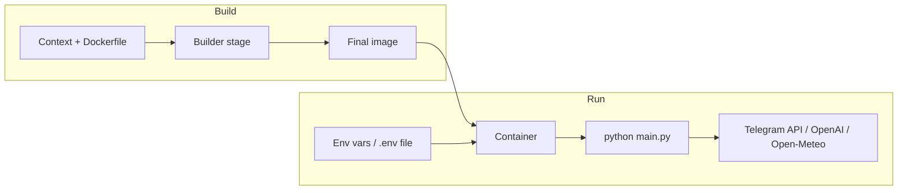

# План контейнеризації додатку (Docker)

## Контекст додатку

- **Точка входу:** [main.py](main.py) — завантажує `.env`, перевіряє конфіг, запускає long polling бота.
- **Залежності:** [requirements.txt](requirements.txt) (prod); Python >=3.10 ([pyproject.toml](pyproject.toml)).
- **Секрети:** лише змінні середовища (`TELEGRAM_BOT_TOKEN`, `OPENAI_API_KEY`); файл `.env` не повинен потрапляти в образ.
- **Мережа:** лише вихідні виклики (Telegram API, Open-Meteo, OpenAI); вхідний порт не потрібен.

---

## 1. Базовий Dockerfile (найкращі практики)

**Базовий образ:** `python:3.12-slim-bookworm` (Debian slim — краща підтримка wheels, менше CVE ніж alpine для Python).

**Multi-stage build:**

- **Stage 1 (builder):** встановити залежності в віртуальне середовище або в окрему директорію, зібрати при потребі wheels.
- **Stage 2 (runtime):** копіювати лише `src/`, `main.py`, встановлені пакети; без pip, gcc, build-essential.

**Ключові кроки у фінальному образі:**

- Встановлення залежностей через `pip install --no-cache-dir --no-compile` (менший розмір, без кешу).
- Копіювання лише потрібних артефактів: `src/weather_agent/`, `main.py`, `requirements.txt` (або лише скопійовані пакети з builder).
- Один процес на контейнер: `CMD ["python", "-m", "weather_agent"]` або запуск `main.py` після `pip install -e .` у builder (тоді в образ копіювати `pyproject.toml` + `src/` і встановити пакет у builder, у runtime лише копіювати віртуальне середовище та код).

Рекомендація: у builder зробити `pip install -r requirements.txt` у venv, потім у runtime скопіювати `venv`, `src/`, `main.py` і встановити `WORKDIR` та `PATH` так, щоб `python main.py` працював (або встановити пакет як editable у builder і в runtime копіювати тільки `site-packages` та код — складніше). Простіший варіант: одноетапний slim-образ з `pip install --no-cache-dir -r requirements.txt` і копіюванням коду (без builder stage), або двома етапами: builder встановлює залежності в `/opt/venv`, runtime копіює `/opt/venv` + код.

**Приклад логіки двох етапів:**

- Builder: `FROM python:3.12-slim-bookworm` → створює `/opt/venv`, `pip install -r requirements.txt`, копіює `src/` та `main.py` (для можливого `pip install -e .` або для копіювання в final).
- Final: `FROM python:3.12-slim-bookworm` → копіює `/opt/venv` з builder, копіює `src/`, `main.py`; `ENV PATH="/opt/venv/bin:$PATH"`; немає pip/packages у final (опційно залишити тільки runtime pip для мінімального образу).

Спрощений і безпечний варіант: один stage на slim, `pip install --no-cache-dir -r requirements.txt`, копіювання коду, non-root user, далі — як нижче.

---

## 2. Безпека

| Практика                  | Реалізація                                                                                                                                      |
| ------------------------- | ----------------------------------------------------------------------------------------------------------------------------------------------- |
| **Не root**               | Створити користувача (наприклад `appuser`, UID/GID фіксовані, напр. 1000:1000), `USER appuser`.                                                 |
| **Без секретів в образі** | Не копіювати `.env`, `.env.*`; секрети лише через `ENV` або `docker run -e` / `env_file` у compose.                                             |
| **Мінімальні права**      | Запуск з `--read-only` (root filesystem read-only). Якщо Python/httpx потребує запису — додати `--tmpfs /tmp`.                                  |
| **Немає зайвих пакетів**  | Фінальний образ без build-tools, без dev-залежностей (тільки `requirements.txt`, без `[dev]`).                                                  |
| **Фіксовані версії**      | Для відтворюваності та CVE-скану — зафіксувати версії у `requirements.txt` (наприклад `langchain>=0.3.0,<0.4` або точні версії з `pip freeze`). |
| **Сканування**            | Запускати `docker scout` або `trivy image` у CI для перевірки базового образу та залежностей.                                                   |

Додатково: `HEALTHCHECK` для long-polling бота — або простий перевірка того, що процес живе (наприклад `CMD` залишається основним процесом), або пропустити HEALTHCHECK; при потребі можна додати легкий endpoint (наприклад internal HTTP на 127.0.0.1) лише для health — це вже зміна коду, не обов’язково для першої версії.

---

## 3. Ефективність образу

- **.dockerignore:** виключити `venv/`, `tests/`, `.git/`, `__pycache__/`, `.env*`, `doc/`, `.cursor/`, `*.egg-info/`, `.pytest_cache/`, `*.md` (крім README якщо потрібно), щоб контекст збірки був мінімальним і в образ не потрапляло зайве.
- **Один RUN для pip:** об’єднати оновлення та встановлення пакетів в один `RUN`, щоб зменшити кількість шарів.
- **Порядок копіювання:** спочатку `requirements.txt`, потім `pip install`, потім копіювання коду — щоб зміни коду не інвалідували кеш pip.
- **Slim образ:** не використовувати `python:3.12` (full), лише `python:3.12-slim-bookworm`.

---

## 4. Файли для додавання/зміни

| Файл                             | Призначення                                                                                                                                     |
| -------------------------------- | ----------------------------------------------------------------------------------------------------------------------------------------------- |
| **Dockerfile**                   | Multi-stage або single-stage на `python:3.12-slim-bookworm`, non-root user, `WORKDIR`, `CMD ["python", "main.py"]` (або `python -m` з пакетом). |
| **.dockerignore**                | Виключити все, що не потрібно для збірки та запуску (тести, venv, .env, .git, docs, кеші).                                                      |
| **docker-compose.yml** (опційно) | Один сервіс `weather-agent`, передача `env_file: .env` або `environment`, restart policy, можливо `read_only: true` та `tmpfs: - /tmp`.         |
| **README.md**                    | Додати розділ «Docker»: як зібрати образ, як запустити з `docker run` та з compose, що передати в env.                                          |

---

## 5. Запуск і змінні середовища

- Збірка: `docker build -t weather-agent:latest .`
- Запуск:  
`docker run --read-only --tmpfs /tmp -e TELEGRAM_BOT_TOKEN=... -e OPENAI_API_KEY=... weather-agent:latest`  
або з файлом: `docker run --env-file .env ...` (файл `.env` лише на хості, не в образі).
- У compose: сервіс з `env_file: .env`, `restart: unless-stopped`, при потребі `read_only: true`, `tmpfs: - /tmp`.

---

## 6. Діаграма потоку збірки та запуску

---

## 7. Підсумок кроків реалізації

1. Додати **.dockerignore** (venv, tests, .git, .env*, **pycache**, doc, тощо).
2. Написати **Dockerfile**: slim base, встановлення залежностей з `requirements.txt`, копіювання `src/` та `main.py`, створення non-root user, `WORKDIR`, `CMD`.
3. Опційно: **docker-compose.yml** з `env_file`, `read_only`, `tmpfs`, restart policy.
4. Оновити **README.md**: секція Docker (build, run, compose, безпека).
5. За бажанням: зафіксувати версії у **requirements.txt** для відтворюваності та безпеки; додати перевірку образу (trivy/scout) у CI.

Після підтвердження плану можна перейти до конкретних фрагментів Dockerfile та .dockerignore під твій репозиторій.