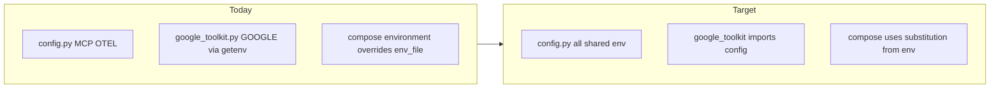

# Unified env (Docker + local) and faster Google Calendar onboarding

## Current gaps


| Area                                                                                           | Issue                                                                                                                                                                                                                                   |
| ---------------------------------------------------------------------------------------------- | --------------------------------------------------------------------------------------------------------------------------------------------------------------------------------------------------------------------------------------- |
| `[src/weather_agent/config.py](src/weather_agent/config.py)`                                   | Defines `MCP_*` and OTEL vars, but **not** `GOOGLE_CALENDAR_`*.                                                                                                                                                                         |
| `[src/weather_agent/calendar/google_toolkit.py](src/weather_agent/calendar/google_toolkit.py)` | Reads `GOOGLE_CALENDAR_CREDENTIALS_PATH` / `GOOGLE_CALENDAR_TOKEN_PATH` via `**os.getenv` at import time** only — duplicated pattern and no single place for defaults/docs.                                                             |
| `[docker-compose.yml](docker-compose.yml)`                                                     | `weather-agent.environment` **hardcodes** `OTEL_`* values, which **override** the same keys from `env_file: .env` (Compose precedence). Local `.env` settings for OTLP/environment are ignored for those three keys when using Compose. |
| `[Dockerfile](Dockerfile)`                                                                     | `WORKDIR /app`, read-only runtime in Compose — **no volume** for `credentials.json` / `token.json`. First-time OAuth inside the container is impractical (needs writable store + browser flow).                                         |
| Google OAuth                                                                                   | Typical flow: obtain `credentials.json` locally, run OAuth once to create `token.json`, then deploy — this should be **scripted and documented** to reduce trial-and-error.                                                             |





---

## Part A — Unify environment variables (code)

1. **Extend `[src/weather_agent/config.py](src/weather_agent/config.py)`** with:
  - `GOOGLE_CALENDAR_CREDENTIALS_PATH: str | None` — strip empty strings to `None` (same pattern as `OTEL_EXPORTER_OTLP_ENDPOINT`).
  - `GOOGLE_CALENDAR_TOKEN_PATH: str | None` — same.
  - Optional: `GOOGLE_CALENDAR_DATA_DIR` or document-only default `APP_HOME` — only if you want a single base path for Docker (`/app/secrets`); otherwise keep two explicit paths.
2. **Refactor `[src/weather_agent/calendar/google_toolkit.py](src/weather_agent/calendar/google_toolkit.py)`** to import these names from `weather_agent.config` instead of calling `os.getenv` at module level. Keep `@lru_cache` on `_build_calendar_toolkit()`; behavior stays the same.
3. **No change required** to `[src/weather_agent/mcp/client.py](src/weather_agent/mcp/client.py)` for sourcing env (already uses `config`). Optionally re-export or document in one place that **MCP + Google** both live under `config.py`.
4. `**[.env.example](.env.example)`** — add a short subsection that lists **container-friendly examples**:
  - Local: `GOOGLE_CALENDAR_CREDENTIALS_PATH=./credentials.json`
  - Docker: `GOOGLE_CALENDAR_CREDENTIALS_PATH=/app/secrets/credentials.json` (when using a bind mount; see Part B).

---

## Part B — Docker and Compose alignment

1. `**docker-compose.yml` — OTEL without clobbering `.env`**
  Replace fixed strings with **variable substitution** so host `.env` can override defaults, while Compose still provides sensible defaults for in-network collectors:
  - Example pattern: `OTEL_EXPORTER_OTLP_ENDPOINT=${OTEL_EXPORTER_OTLP_ENDPOINT:-http://otel-collector:4318}`
  - `OTEL_SERVICE_NAME=${OTEL_SERVICE_NAME:-weather-agent}`
  - `OTEL_DEPLOYMENT_ENVIRONMENT=${OTEL_DEPLOYMENT_ENVIRONMENT:-production}`
   Document that **empty** `OTEL_EXPORTER_OTLP_ENDPOINT` in `.env` may still expand to the default unless the user unsets the variable entirely — if you need “telemetry off in Docker”, add one line in the plan doc: use `OTEL_EXPORTER_OTLP_ENDPOINT=` unset in shell or a dedicated `profiles:` block.
2. **Optional Google Calendar volumes (commented or profile)**
  Add a **commented** example under `weather-agent`:

```yaml
   # volumes:
   #   - ./secrets/google:/app/secrets:ro
   

```

   And document matching env:

   `GOOGLE_CALENDAR_CREDENTIALS_PATH=/app/secrets/credentials.json`, `GOOGLE_CALENDAR_TOKEN_PATH=/app/secrets/token.json`.

   For **refresh tokens**, `token.json` must be **writable** at least once — use `:rw` for the first run or generate `token.json` on the host and mount read-only afterward.

1. `**Dockerfile`**
  - No secrets baked into the image. Optional: `RUN mkdir -p /app/secrets && chown appuser` so a volume mount has correct ownership, or document that users mount with correct uid `1000`.

---

## Part C — Speed up Google Calendar integration (onboarding)

1. **Small OAuth helper script** (new file, e.g. `[scripts/google_calendar_oauth.py](scripts/google_calendar_oauth.py)` or `python -m weather_agent.tools.oauth_google`):
  - Uses the same scopes as `[google_toolkit.py](src/weather_agent/calendar/google_toolkit.py)` (`calendar.readonly`).
  - Reads `GOOGLE_CALENDAR_CREDENTIALS_PATH` / token path from **config** (after `load_dotenv`).
  - Runs the Google **installed app** OAuth flow once; writes `token.json` next to credentials (or path from env).
  - Clear stdout messages in Ukrainian or English aligned with the rest of the project.
2. **Makefile target** e.g. `google-calendar-oauth: install` that runs the script with `venv` python — one command for students.
3. **Docs touch-up** — `[doc/Deployment_and_MCP_Setup.md](doc/Deployment_and_MCP_Setup.md)` (and a short pointer in `[README.md](README.md)`):
  - Step order: (1) Google Cloud Console credentials, (2) `make google-calendar-oauth`, (3) set env paths, (4) run bot locally or mount files for Docker.
  - Explicit **Docker** subsection: generate token on host, mount `secrets/`, set paths to `/app/...`.
4. **Optional “fail-soft” behavior** (only if you want faster *startup* when Calendar is misconfigured): if `GOOGLE_CALENDAR_CREDENTIALS_PATH` is unset, return **no calendar tools** instead of calling `CalendarToolkit()` (which may error or block). This is a **behavior change** — confirm with product preference; otherwise skip and only document required env.

---

## Testing / regression

- Update `[tests/UnitMock/test_calendar_toolkit_adapter.py](tests/UnitMock/test_calendar_toolkit_adapter.py)` (if present) or any test that patches Google env — ensure imports still resolve after moving vars to `config.py`.
- Run existing `test-no-llm` suite.

---

## Files to touch (summary)


| File                                                                                           | Change                                                                      |
| ---------------------------------------------------------------------------------------------- | --------------------------------------------------------------------------- |
| `[src/weather_agent/config.py](src/weather_agent/config.py)`                                   | Add Google Calendar env vars (normalized).                                  |
| `[src/weather_agent/calendar/google_toolkit.py](src/weather_agent/calendar/google_toolkit.py)` | Import from `config`.                                                       |
| `[docker-compose.yml](docker-compose.yml)`                                                     | OTEL `${VAR:-default}`; optional commented volume block for Google secrets. |
| `[Dockerfile](Dockerfile)`                                                                     | Optional `/app/secrets` dir + ownership, or docs only.                      |
| `[.env.example](.env.example)`                                                                 | Docker path examples + OTEL substitution note.                              |
| New script + `[Makefile](Makefile)`                                                            | OAuth helper + target.                                                      |
| `[doc/Deployment_and_MCP_Setup.md](doc/Deployment_and_MCP_Setup.md)`, `[README.md](README.md)` | Short “fast path” for Calendar.                                             |


