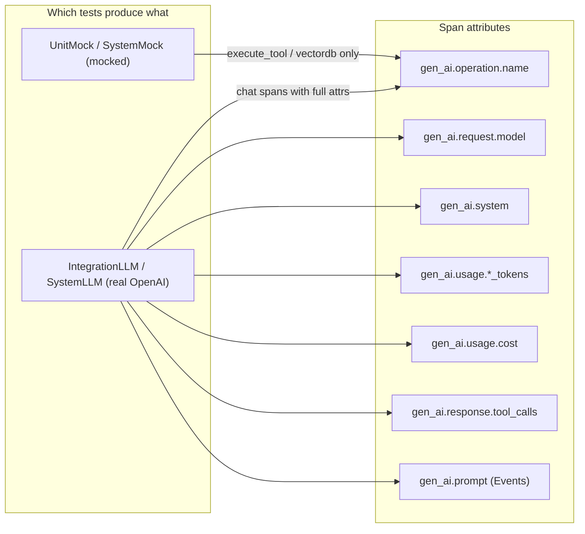

# Fill all Grafana GenAI dashboard panels

## Root cause

The dashboard panels query specific `**gen_ai.*` span attributes** set only by OpenLIT on **real LLM chat** spans. Currently `make test-with-otel-export` runs `test-no-llm` folders (UnitMock, UnitLLM, IntegrationMock, SystemMock) where LLM calls are **mocked** -- no real OpenAI call happens, so OpenLIT never emits `gen_ai.request.model`, `gen_ai.system`, `gen_ai.usage.`*, `gen_ai.usage.cost`, `gen_ai.response.tool_calls`, etc.




## What each panel needs (mapped to spans)

- **Total GenAI Requests / By Type** -- `gen_ai.operation.name` -- already works.
- **Top Models** -- `gen_ai.request.model` -- needs a real `ChatOpenAI` call.
- **Top Tools** -- `gen_ai.response.tool_calls` in JSON shape -- needs an agent call where the model chooses a tool.
- **By Platform** -- `gen_ai.system` -- set on OpenAI chat spans.
- **By Application** -- `ServiceName` where `gen_ai.system` is set.
- **By Environment** -- `deployment.environment` + `gen_ai.system`.
- **Avg Tokens / Prompt / Completion** -- `gen_ai.usage.total_tokens`, `input_tokens`, `output_tokens`.
- **Cost** -- `gen_ai.usage.cost`.
- **Duration chart** -- `Duration` where `gen_ai.system` is set.
- **Last Prompts** -- `Events.Attributes['gen_ai.prompt']` -- needs `capture_message_content=True`.
- **Last Exceptions** -- `Events.Attributes['exception.*']` -- needs a span that recorded an error.

## Changes

### 1. Add `test-with-otel-llm` Makefile target

In `[Makefile](Makefile)`, add a new target that runs **IntegrationLLM + SystemLLM** (real OpenAI) with OTLP export, so a single `make` command sends full-attribute traces to Grafana:

```makefile
test-with-otel-llm: install
	OTEL_TESTS_EXPORT=1 \
	OTEL_EXPORTER_OTLP_ENDPOINT=$${OTEL_EXPORTER_OTLP_ENDPOINT:-http://localhost:4318} \
	OTEL_SERVICE_NAME=$${OTEL_SERVICE_NAME:-weather-agent-tests} \
	OTEL_DEPLOYMENT_ENVIRONMENT=$${OTEL_DEPLOYMENT_ENVIRONMENT:-test} \
	$(VENV_PYTHON) -m pytest tests/IntegrationLLM/ tests/SystemLLM/ -v
```

Also update the existing `test-with-otel-export` to include `IntegrationLLM/` and `SystemLLM/` so all test folders export (not just no-llm folders).

### 2. Update `help` and `.PHONY` in Makefile

Add `test-with-otel-llm` to `.PHONY` and `help`.

### 3. Update docs

- `[README.md](README.md)` -- mention `make test-with-otel-llm` in the **Pytest and Grafana** section; explain it requires `OPENAI_API_KEY`.
- `[doc/Observability_Guide.md](doc/Observability_Guide.md)` section 7 -- add note that mock tests only produce partial attributes; for all panels use `make test-with-otel-llm`.

### 4. No code changes to app or dashboard

The spans already carry the right attributes when OpenLIT instruments a **real** ChatOpenAI call. No dashboard SQL changes needed.

## Usage after implementation

```bash
make observability-up                 # ClickHouse + Collector + Grafana
OPENAI_API_KEY=sk-... make test-with-otel-llm   # real LLM tests with OTLP
# Open Grafana -> GenAI Cost Dashboard -> Last 15 min -> all panels filled
```

