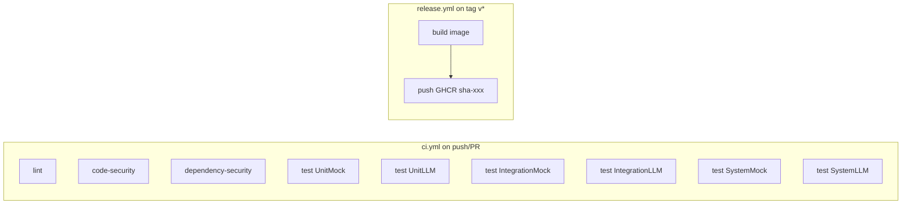

# План налаштування GitHub Actions

## Мета

- Один workflow (або кілька) з окремими job: **linter**, **code security**, **dependency security**, **тести по групах** (6 фаз), **build image**, **push to GHCR** при новому git-тегу з тегом образу за хешем коміту.

## Контекст проєкту

- **Мова:** Python 3.10+, [pyproject.toml](pyproject.toml), [requirements.txt](requirements.txt).
- **Тести:** pytest з маркерами та директоріями [tests/](tests/) — UnitMock, UnitLLM, IntegrationMock, IntegrationLLM, SystemMock, SystemLLM. IntegrationLLM і SystemLLM потребують `OPENAI_API_KEY` (у CI можна пропускати або передавати через secret).
- **Docker:** [Dockerfile](Dockerfile) у корені, образ `weather-agent:latest` локально.
- **Репозиторій:** `.github/` відсутній — створюється з нуля.

---

## 1. Структура workflow

Рекомендація: **два YAML-файли**.

| Файл                            | Тригер                                    | Призначення                                                                   |
| ------------------------------- | ----------------------------------------- | ----------------------------------------------------------------------------- |
| `.github/workflows/ci.yml`      | `push` (main/master), `pull_request`      | Lint, code security, dependency security, усі 6 груп тестів                   |
| `.github/workflows/release.yml` | `push` з тегами `v*` (наприклад `v1.0.0`) | Build образу, push в GHCR з тегом за short commit SHA (та опційно за git tag) |

Альтернатива: один файл з умовами `if: github.event_name == 'push' && startsWith(github.ref, 'refs/tags/')` для release-кроків — можна, але розділення спрощує читання і права (release може вимагати інших permissions).

---

## 2. Job 1: Лінтер (окремо)

- **Назва job:** `lint`.
- **Інструмент:** Ruff (швидкий, один інструмент замість flake8 + isort + частини black). Альтернатива: Flake8 + isort у двох кроках.
- **Кроки:**
  1. Checkout.
  2. Setup Python (наприклад `actions/setup-python` з `python-version: '3.12'` та кешем `pip`).
  3. `pip install ruff` (або додати ruff у `[project.optional-dependencies].dev` в pyproject.toml і встановлювати `pip install -e ".[dev]"` + окремо ruff якщо не в dev).
  4. Запуск: `ruff check .` та за бажанням `ruff format --check .`.
- **Рекомендація:** додати в проєкт конфіг для Ruff, наприклад `pyproject.toml` секція `[tool.ruff]` та `[tool.ruff.format]`, щоб CI і локальна перевірка співпадали.

Файли: [pyproject.toml](pyproject.toml) (опційно — секція `[tool.ruff]`), `.github/workflows/ci.yml` (job `lint`).

---

## 3. Job 2: Аналізатор безпеки коду (окремо)

- **Назва job:** `code-security` (або `security-sast`).
- **Інструмент:** Bandit (Python SAST). Альтернатива: Semgrep (більш універсальний, потребує конфігу або готового rule set).
- **Кроки:**
  1. Checkout, Setup Python, встановити залежності проєкту + bandit.
  2. Запуск: `bandit -r src/ -ll` (або `-r . --exclude ./tests,./venv`). Можна вивести у файл у форматі (наприклад JSON) для артефакту.
- **Важливо:** не включати в сканування `venv/` та кеші; контекст збірки вже без них за умови checkout без venv.

Файл: `.github/workflows/ci.yml` (job `code-security`).

---

## 4. Job 3: Аналізатор безпеки залежностей (окремо)

- **Назва job:** `dependency-security`.
- **Інструмент:** `pip-audit` (рекомендований PyPA) або `safety` (потребує API-ключ для повноти). Достатньо `pip-audit`.
- **Кроки:**
  1. Checkout, Setup Python.
  2. Створити venv або використати системний pip, встановити залежності: `pip install -r requirements.txt` (або з pyproject.toml).
  3. Запуск: `pip install pip-audit && pip-audit` (перевірка встановлених пакетів на відомі вразливості).
- Можна кешувати venv/pip, щоб при однакових requirements не перевстановлювати все.

Файл: `.github/workflows/ci.yml` (job `dependency-security`).

---

## 5. Job 4: Тести — окремі фази для кожної групи

Шість груп згідно з проєктом: **UnitMock**, **UnitLLM**, **IntegrationMock**, **IntegrationLLM**, **SystemMock**, **SystemLLM**.

**Варіант A — шість окремих job (паралельно):**

- Кожен job: checkout, setup Python, cache pip, `pip install -e ".[dev]"`, потім один виклик pytest для відповідної директорії/маркера.
- UnitMock: `pytest tests/UnitMock/ -v`
- UnitLLM: `pytest tests/UnitLLM/ -v`
- IntegrationMock: `pytest tests/IntegrationMock/ -v`
- IntegrationLLM: `pytest tests/IntegrationLLM/ -v` — потребує `OPENAI_API_KEY`. У CI: або передати secret і додати в `env`, або пропускати за умовою (наприклад `if: github.event_name == 'push' && github.ref == 'refs/heads/main'`) або завжди запускати з secret (якщо ключ є).
- SystemMock: `pytest tests/SystemMock/ -v`
- SystemLLM: `pytest tests/SystemLLM/ -v` — аналогічно до IntegrationLLM щодо API key.

**Варіант B — один job з шістьма кроками (sequential):**

- Один job `test` з кроками: install deps один раз, потім шість кроків `run: pytest tests/UnitMock/ -v` тощо. Швидше за рахунок одного venv, але без паралелізму.

Рекомендація: **Варіант A** (шість job) — краща паралелізація та чіткі фази; можна об’єднати UnitMock + UnitLLM у один job і IntegrationMock + SystemMock у інший, якщо хочете менше job, але «окремі фази для усіх груп» найпростіше реалізувати як окремі job.

Залежності між job: lint, code-security, dependency-security можуть йти паралельно; тести можуть залежати тільки від checkout (або нічого не залежати). Build image — тільки після успішних тестів у release workflow.

---

## 6. Job 5: Build Docker image

- **Де:** у `release.yml`, після створення тегу.
- **Назва job:** `build-image`.
- **Кроки:**
  1. Checkout.
  2. Set up Docker Buildx (для кращої сумісності та кешу).
  3. `docker build -t <local-tag> .` (наприклад тег з short SHA для наступного кроку).
- Образ не пушити в цьому job — лише зібрати і передати в наступний job через registry або через save/load. У стандартному підході GHCR: один job робить build і push (метадані тегу з `github.sha`).

---

## 7. Job 6: Push в GitHub Container Registry (GHCR) з тегом за хешем коміту

- **Тригер:** `push` з тегами, наприклад `refs/tags/v*`.
- **Умова:** `if: startsWith(github.ref, 'refs/tags/')`.
- **Тег образу:** за вимогою — **хеш коміту (останнього)**. У події `push` з тегом `ref` вказує на тег (наприклад `refs/tags/v1.0.0`), а `github.sha` — це SHA коміту, на який вказує цей тег. Тому `github.sha` і є «останній коміт» для цього тегу. Short SHA: `${{ github.sha }}` обрізати до 7 символів у bash або через `env`: `SHORT_SHA: ${{ github.sha }}` і в скрипті використати `${SHORT_SHA:0:7}` (у bash). У GitHub Actions для тегу образу можна задати `ghcr.io/<owner>/<repo>:sha-${GITHUB_SHA::7}` — в YAML це передати через env і потім використати в run або в метаданих.
- **Кроки:**
  1. Login to GHCR: `docker/login-action` з `registry: ghcr.io`, використовувати `GITHUB_TOKEN` (або окремий PAT з правами `write:packages`).
  2. Build and push: `docker/build-push-action` з context `.`, image name `ghcr.io/<owner>/weather-agent` (або назва репо), tags: один тег з short SHA, наприклад `sha-$(echo $GITHUB_SHA | cut -c1-7)`. Опційно додати другий тег з git tag (наприклад `v1.0.0`), щоб образ був і за версією, і за хешем.
- **Permissions:** у `release.yml` вказати `contents: read`, `packages: write` для GITHUB_TOKEN.

Приклад тегів образу:

- Обов’язково: `ghcr.io/<owner>/weather-agent:sha-a1b2c3d` (7 символів SHA).
- Опційно: `ghcr.io/<owner>/weather-agent:v1.0.0` (з `github.ref_name` після `refs/tags/`).

---

## 8. Залежності між job (ci.yml)

- Всі job можуть стартувати паралельно від checkout (lint, code-security, dependency-security, test-unit-mock, test-unit-llm, test-integration-mock, test-system-mock).
- test-integration-llm і test-system-llm — теж паралельно з іншими, але з `env.OPENAI_API_KEY` з secret (або skip, якщо секрету немає).

У release.yml:

- Один job: `build-and-push` — checkout → login to GHCR → build with build-push-action і теги (short sha та за бажанням git tag) → push. Окремий job тільки «build» не обов’язковий, якщо використовуємо `docker/build-push-action`, який і збирає, і пушить.

---

## 9. Файли та зміни

| Файл                            | Дія                                                                                                                      |
| ------------------------------- | ------------------------------------------------------------------------------------------------------------------------ |
| `.github/workflows/ci.yml`      | Створити: lint, code-security, dependency-security, 6 test jobs (або 4+2 з умовами для LLM).                             |
| `.github/workflows/release.yml` | Створити: один job на `push` з тегами `v*` — build and push образ у GHCR з тегом `sha-<short-sha>` (та опційно git tag). |
| `pyproject.toml`                | Опційно: додати `ruff` у `[project.optional-dependencies].dev` та секцію `[tool.ruff]` для єдиного стилю.                |

---

## 10. Схема потоків

---

## 11. Уточнення для реалізації

- **Репозиторій:** для GHCR image name потрібно підставити `github.repository` (наприклад `owner/weather-agent`). Образ: `ghcr.io/owner/weather-agent`.
- **IntegrationLLM / SystemLLM:** якщо не передавати `OPENAI_API_KEY`, ці тести падатимуть. Варіанти: (1) додати secret у репо і передавати в env; (2) пропускати ці два job за умовою або запускати з `continue-on-error: true` і не блокувати pipeline; (3) не включати їх у CI. План передбачає передачу secret, якщо він налаштований.
- **Ruff/Bandit/pip-audit:** у першому запуску додати їх у CI через `pip install` у відповідних job; опційно зафіксувати версії у requirements-dev або pyproject optional dev.

Після підтвердження плану можна перейти до написання конкретних YAML та опційно конфігу Ruff у pyproject.toml.