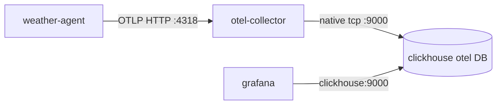

# Why Grafana shows no values (analysis)

## Architecture (what actually runs)

`[docker-compose.yml](docker-compose.yml)` defines the pipeline **without** any SigNoz service:

- **App:** `[main.py](main.py)` calls `openlit.init(otlp_endpoint=OTEL_EXPORTER_OTLP_ENDPOINT, ...)` **before** importing the bot so LangChain is instrumented.
- **Config:** `[src/weather_agent/config.py](src/weather_agent/config.py)` sets `OTEL_EXPORTER_OTLP_ENDPOINT` to `**None`** if the env var is unset or blank.
- **Collector:** `[observability/otel-collector-config.yaml](observability/otel-collector-config.yaml)` receives OTLP on `4317/4318`, processes (batch, resource detection, OpenLIT transform), exports to `tcp://clickhouse:9000`, database `otel`, `create_schema: true`.
- **ClickHouse:** `[observability/clickhouse/initdb/01_create_databases.sh](observability/clickhouse/initdb/01_create_databases.sh)` ensures database `otel` exists; tables such as `otel_traces` are created by the exporter.
- **Grafana:** `[observability/grafana/provisioning/datasources/clickhouse.yml](observability/grafana/provisioning/datasources/clickhouse.yml)` points at host `clickhouse`, port `9000`, `defaultDatabase: otel`. The bundled dashboard is `[observability/grafana/provisioning/dashboards/GenAI Observability.json](observability/grafana/provisioning/dashboards/GenAI Observability.json)`.

`**signoz/`:** Not used by this compose file. If present in git, it is auxiliary (e.g. ClickHouse user scripts for quantiles in other stacks) and does **not** affect this Grafana path unless you manually integrate it.

---

## Why panels can be empty (most likely → least)

### 1. OTLP endpoint not set when running outside Docker

Compose sets `OTEL_EXPORTER_OTLP_ENDPOINT=http://otel-collector:4318` for `weather-agent`. If you run `python main.py` on the host **without** `OTEL_EXPORTER_OTLP_ENDPOINT` in `.env`, `[config.py](src/weather_agent/config.py)` passes `**None`** into `openlit.init`. Depending on OpenLIT version, that may disable export or fall back in a way that does not hit your collector—so **nothing** lands in ClickHouse.

**Fix:** For local runs, set e.g. `OTEL_EXPORTER_OTLP_ENDPOINT=http://localhost:4318` (collector ports `4317`/`4318` are published in compose).

### 2. No LLM traffic with GenAI attributes

The provisioned dashboard is **GenAI-specific**: almost every panel filters `otel_traces` with conditions like `SpanAttributes['gen_ai.operation.name'] != ''`, `SpanAttributes['gen_ai.system'] != ''`, token/cost fields, etc. (see `rawSql` in the JSON).

So you will see **empty or zero** values if:

- The bot has not processed messages that trigger LangChain/OpenAI calls since the stack was up, or  
- Spans exist but **without** OpenLIT’s `gen_ai.`* attributes (then rows exist in ClickHouse but every panel predicate fails).

**Fix:** Generate real traffic (e.g. Telegram message that hits the agent + LLM), then refresh Grafana with a time range that includes that period (e.g. Last 1 hour).

### 3. ClickHouse has no rows (collector / connectivity)

If the collector cannot reach ClickHouse or pipelines error, `otel_traces` stays empty. Quick validation (when containers run): run a count query against `otel.otel_traces` (or check collector logs for exporter errors).

### 4. Grafana datasource / plugin issues

- Datasource uses hostname `**clickhouse`** — correct **inside** the Docker network; wrong if Grafana were run elsewhere without that DNS.
- `GF_PLUGINS_PREINSTALL=grafana-clickhouse-datasource` — on first boot Grafana must download the plugin; if that failed, panels can error (check Grafana UI: datasource “Test” and panel inspect → query error text).

### 5. Time picker

Default Grafana range might exclude when traces were written. Widen the range and confirm.

---

## Recommended verification order (no code changes required)

1. Confirm how you run the app: **Docker** `weather-agent` vs **host** `main.py`, and that `OTEL_EXPORTER_OTLP_ENDPOINT` matches (Docker: `http://otel-collector:4318`; host: `http://localhost:4318`).
2. In ClickHouse (CLI or UI), `SELECT count(), max(Timestamp) FROM otel.otel_traces` — if zero, fix export/collector path first.
3. If `count() > 0` but dashboard still empty, `SELECT SpanAttributes FROM otel.otel_traces LIMIT 1` and confirm `**gen_ai.`* keys** exist; if not, the OpenLIT + LangChain path or model calls may not be emitting what the dashboard expects.
4. In Grafana, open a panel → **Query inspector** for SQL/HTTP errors vs “no data”.

---

## If you want code/docs hardening later (optional)

- Document or default OTLP for local dev (e.g. README / `.env.example`) so `None` is never accidental.
- Add a trivial “raw row count” panel or Explore query not filtered by `gen_ai.`* to distinguish “no telemetry” vs “telemetry without GenAI labels”.

