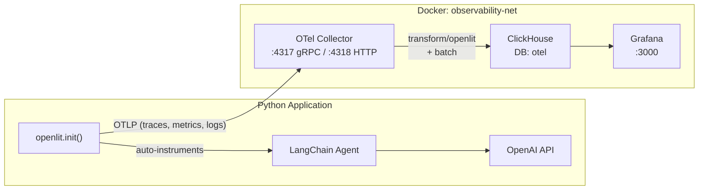

# OpenLIT Observability Integration Plan

## Current State Analysis

The project already has observability **infrastructure** ready in `docker-compose.yml`:

- **ClickHouse** (storage, database `otel`)
- **OTel Collector Contrib** (OTLP gRPC :4317 / HTTP :4318, with `transform/openlit` processor)
- **Grafana** (with ClickHouse datasource + "GenAI Cost Dashboard" JSON)
- **Alert rule** for max token consumption (> 1000 tokens)

What is **missing**: the Python application has **zero instrumentation** -- only basic `logging.basicConfig` in `main.py`. No OpenTelemetry, no OpenLIT SDK, no tracing of LLM calls. The `weather-agent` container is also **not connected** to the `observability-net` Docker network.

## Architecture After Integration




## Data Flow

1. `openlit.init()` is called once at application startup in `[main.py](main.py)` **before** any LangChain/OpenAI imports are used
2. OpenLIT auto-patches `langchain-core`, `langchain-openai`, `openai`, `httpx`, `chromadb` -- all calls generate OTel spans with GenAI semantic attributes (`gen_ai.system`, `gen_ai.request.model`, `gen_ai.usage.total_tokens`, `gen_ai.usage.cost`, etc.)
3. Spans/metrics/logs are exported via OTLP HTTP to the OTel Collector at `http://otel-collector:4318`
4. The collector applies `transform/openlit` (fixes resource attributes), batches, and writes to ClickHouse
5. Grafana queries ClickHouse via the provisioned datasource and displays the "GenAI Cost Dashboard"

---

## Step 1: Add `openlit` Dependency

**Files to modify:**

- `[requirements.txt](requirements.txt)` -- add `openlit>=1.17.0`
- `[pyproject.toml](pyproject.toml)` -- add `"openlit>=1.17.0"` to `dependencies`

This single package brings in all necessary OTel SDKs and auto-instrumentation for LangChain, OpenAI, httpx, ChromaDB.

---

## Step 2: Add Observability Configuration to `config.py`

**File:** `[src/weather_agent/config.py](src/weather_agent/config.py)`

Add new configuration variables for OpenLIT/OTLP:

```python
# Observability (OpenLIT / OpenTelemetry)
OTEL_EXPORTER_OTLP_ENDPOINT: str | None = os.getenv("OTEL_EXPORTER_OTLP_ENDPOINT")
OTEL_SERVICE_NAME: str = os.getenv("OTEL_SERVICE_NAME", "weather-agent")
OTEL_DEPLOYMENT_ENVIRONMENT: str = os.getenv("OTEL_DEPLOYMENT_ENVIRONMENT", "development")
OPENLIT_CAPTURE_MESSAGE_CONTENT: bool = (
    os.getenv("OTEL_INSTRUMENTATION_GENAI_CAPTURE_MESSAGE_CONTENT", "true").lower() == "true"
)
```

Key design decisions:

- `OTEL_EXPORTER_OTLP_ENDPOINT` defaults to `None` -- if not set, OpenLIT does not export (safe for local dev without Docker stack)
- `OTEL_SERVICE_NAME` defaults to `"weather-agent"`
- `OTEL_DEPLOYMENT_ENVIRONMENT` defaults to `"development"`
- `capture_message_content` is configurable (privacy control for production)

---

## Step 3: Initialize OpenLIT in `main.py`

**File:** `[main.py](main.py)`

Add `openlit.init()` call **before** `build_application()`:

```python
import openlit
from weather_agent.config import (
    OTEL_EXPORTER_OTLP_ENDPOINT,
    OTEL_SERVICE_NAME,
    OTEL_DEPLOYMENT_ENVIRONMENT,
    OPENLIT_CAPTURE_MESSAGE_CONTENT,
    require_openai_key,
    require_telegram_token,
)

def main() -> None:
    load_dotenv()

    openlit.init(
        otlp_endpoint=OTEL_EXPORTER_OTLP_ENDPOINT,
        service_name=OTEL_SERVICE_NAME,
        environment=OTEL_DEPLOYMENT_ENVIRONMENT,
        capture_message_content=OPENLIT_CAPTURE_MESSAGE_CONTENT,
    )

    token = require_telegram_token()
    require_openai_key()
    app = build_application(token)
    app.run_polling(allowed_updates=["message"])
```

Why this placement:

- `openlit.init()` must run before any LLM library is invoked so the monkey-patching captures all calls
- It runs after `load_dotenv()` so environment variables are available
- If `otlp_endpoint` is `None`, OpenLIT initializes instrumentors but does not export -- safe for dev/testing

---

## Step 4: Connect `weather-agent` to Docker Observability Network

**File:** `[docker-compose.yml](docker-compose.yml)`

Two changes:

1. Add `networks: [observability-net]` to the `weather-agent` service so it can resolve `otel-collector` hostname
2. Add OTLP environment variables to the service

```yaml
services:
  weather-agent:
    build: .
    image: weather-agent:latest
    container_name: weather-agent
    env_file: .env
    restart: unless-stopped
    read_only: true
    tmpfs:
      - /tmp
    networks:
      - observability-net
    environment:
      - OTEL_EXPORTER_OTLP_ENDPOINT=http://otel-collector:4318
      - OTEL_SERVICE_NAME=weather-agent
      - OTEL_DEPLOYMENT_ENVIRONMENT=production
    depends_on:
      otel-collector:
        condition: service_started
```

---

## Step 5: Update `.env.example`

**File:** `[.env.example](.env.example)`

Add a new section with educational comments:

```dotenv
# ─── Observability (OpenLIT / OpenTelemetry) ───
# Endpoint OTLP-колектора. У Docker Compose вже налаштований автоматично.
# Для локальної розробки з docker compose: http://localhost:4318
# Залиште порожнім, щоб вимкнути експорт телеметрії (трейси не відправлятимуться).
# OTEL_EXPORTER_OTLP_ENDPOINT=http://localhost:4318

# Назва сервісу в трейсах (відображається в Grafana)
# OTEL_SERVICE_NAME=weather-agent

# Середовище розгортання (development / staging / production)
# OTEL_DEPLOYMENT_ENVIRONMENT=development

# Чи записувати вміст промптів та відповідей LLM у трейси (true/false)
# Увага: у production може містити персональні дані користувачів!
# OTEL_INSTRUMENTATION_GENAI_CAPTURE_MESSAGE_CONTENT=true
```

---

## Step 6: Update `Dockerfile`

**File:** `[Dockerfile](Dockerfile)` -- no changes needed for `openlit` itself (it is a pure Python package and will be installed via `requirements.txt` during the builder stage). Verify this by reading the Dockerfile.

---

## Step 7: Add Observability Make Targets

**File:** `[Makefile](Makefile)`

Add educational-friendly targets:

```makefile
# --- Observability ---
observability-up:
	docker compose up -d clickhouse otel-collector grafana

observability-down:
	docker compose down

observability-logs:
	docker compose logs -f otel-collector

run-with-otel: install
	OTEL_EXPORTER_OTLP_ENDPOINT=http://localhost:4318 \
	OTEL_SERVICE_NAME=weather-agent \
	OTEL_DEPLOYMENT_ENVIRONMENT=development \
	PROMPT_VERSION=$(PROMPT_VERSION) $(VENV_PYTHON) main.py
```

- `make observability-up` -- start only the observability stack (no bot)
- `make run-with-otel` -- run the bot locally with OTLP export to the Docker collector

---

## Step 8: Update Tests Configuration

**File:** `[tests/conftest.py](tests/conftest.py)`

Ensure OpenLIT does not interfere with tests:

- Set `OTEL_EXPORTER_OTLP_ENDPOINT=""` in the `env_isolate` fixture to disable telemetry export during tests
- This prevents test runs from sending spans to any collector

---

## Step 9: Add Unit Test for OpenLIT Initialization

**File (new):** `tests/UnitMock/test_observability.py`

A simple test verifying:

- `openlit` can be imported
- `openlit.init()` works without an OTLP endpoint (no export, no crash)
- Config variables (`OTEL_SERVICE_NAME`, etc.) are loaded correctly from `config.py`

---

## Step 10: Update CI Pipeline

**File:** `[.github/workflows/ci.yml](.github/workflows/ci.yml)`

Ensure the `openlit` dependency is installed in all test jobs. Since it's in `requirements.txt` and `pyproject.toml`, existing `pip install -e ".[dev]"` steps already cover this. No changes needed unless we want to add a dedicated observability test job (optional, low priority).

---

## Step 11: Fix Grafana Dashboard Datasource UID

**File:** `[observability/grafana/provisioning/dashboards/GenAI Observability.json](observability/grafana/provisioning/dashboards/GenAI%20Observability.json)`

The dashboard currently hardcodes datasource UID `P7E099F39B84EA795`. This must match the provisioned ClickHouse datasource. Two approaches:

- Option A: Add `uid: P7E099F39B84EA795` to the datasource definition in `[observability/grafana/provisioning/datasources/clickhouse.yml](observability/grafana/provisioning/datasources/clickhouse.yml)`
- Option B: Replace all `datasourceUid` references in the dashboard JSON with `"uid": "clickhouse"` and set `uid: clickhouse` in the datasource YAML

Option A is simpler and less error-prone.

---

## Step 12: Update Alert Rule Datasource UID

**File:** `[observability/grafana/provisioning/alerting/alert-rules.yaml](observability/grafana/provisioning/alerting/alert-rules.yaml)`

Same issue: alert query references `datasourceUid: P7E099F39B84EA795`. Must be consistent with the datasource provisioning fix from Step 11.

---

## Step 13: Comprehensive Documentation Update

**File:** `[README.md](README.md)`

Add a new major section "Observability (Моніторинг)" after the Docker section, covering:

1. **Architecture overview** -- what OpenLIT does, how the telemetry pipeline works
2. **Quick start** -- `make observability-up` + `make run-with-otel` + open Grafana at localhost:3000
3. **What is being monitored** -- list of auto-instrumented calls (LLM, embeddings, tools)
4. **GenAI semantic attributes** -- explain key attributes visible in traces
5. **Grafana dashboard** -- what panels show, how to read them
6. **Alert rules** -- what the token consumption alert does
7. **Configuration reference** -- table of all OTEL_* env vars
8. **Local development** -- how to run with/without observability

**File (new):** `[doc/Observability_Guide.md](doc/Observability_Guide.md)`

A detailed educational guide covering:

1. **What is Observability for AI applications?** -- traces, metrics, logs explained
2. **OpenLIT SDK** -- what it does, how auto-instrumentation works
3. **OpenTelemetry Collector** -- role, configuration breakdown of `[observability/otel-collector-config.yaml](observability/otel-collector-config.yaml)`
4. **ClickHouse** -- why it's used, what tables are created, the init script
5. **Grafana** -- datasource config, dashboard JSON structure, alerting
6. **File-by-file reference:**
  - `observability/otel-collector-config.yaml` -- every section explained
  - `observability/clickhouse/initdb/01_create_databases.sh` -- what it does
  - `observability/grafana/provisioning/datasources/clickhouse.yml` -- field-by-field
  - `observability/grafana/provisioning/dashboards/dashboards.yml` -- how provisioning works
  - `observability/grafana/provisioning/dashboards/GenAI Observability.json` -- panel descriptions
  - `observability/grafana/provisioning/alerting/alert-rules.yaml` -- alert logic explained
7. **Troubleshooting** -- common issues (no traces appearing, datasource UID mismatch, network connectivity)
8. **GenAI Semantic Conventions reference** -- table of `gen_ai.`* attributes that OpenLIT emits

---

## Step 14: Update `.gitignore`

**File:** `[.gitignore](.gitignore)`

Ensure ClickHouse/Grafana Docker volumes and any local OTel data are ignored (verify current state).

---

## Summary of Files Changed


| File                                                            | Action                                          |
| --------------------------------------------------------------- | ----------------------------------------------- |
| `requirements.txt`                                              | Add `openlit>=1.17.0`                           |
| `pyproject.toml`                                                | Add `"openlit>=1.17.0"` to dependencies         |
| `src/weather_agent/config.py`                                   | Add OTEL_* config variables                     |
| `main.py`                                                       | Add `openlit.init()` call                       |
| `docker-compose.yml`                                            | Add network + OTEL env vars to weather-agent    |
| `.env.example`                                                  | Add observability env vars section              |
| `Makefile`                                                      | Add `observability-up`, `run-with-otel` targets |
| `tests/conftest.py`                                             | Disable OTLP export in test env                 |
| `tests/UnitMock/test_observability.py`                          | New test for OpenLIT init                       |
| `observability/grafana/provisioning/datasources/clickhouse.yml` | Fix UID                                         |
| `observability/grafana/provisioning/alerting/alert-rules.yaml`  | Fix datasource UID                              |
| `README.md`                                                     | Add Observability section                       |
| `doc/Observability_Guide.md`                                    | New comprehensive guide                         |
| `.gitignore`                                                    | Verify/update                                   |


