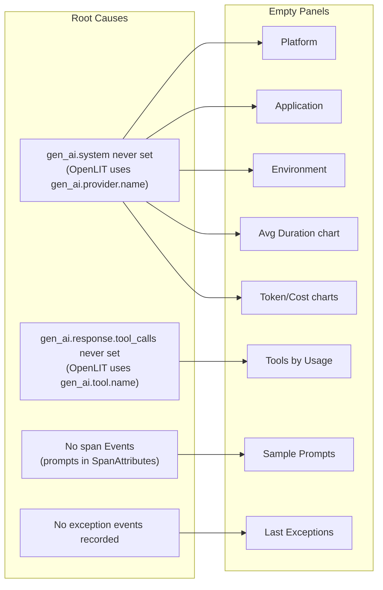

# Populate All Grafana Dashboard Panels

## Current State (from ClickHouse + Browser)

113 total spans in ClickHouse. Panel coverage:

**Filled panels**: Total Requests, Models, Type, Token stats, Cost stats, Diagnostics
**Empty panels (7)**:

- **Top GenAI Tools by Usage** -- dashboard reads `gen_ai.response.tool_calls` (JSON), OpenLIT writes `gen_ai.tool.name` on separate `execute_tool` spans
- **GenAI Requests by Platform** -- dashboard reads `gen_ai.system`, OpenLIT writes `gen_ai.provider.name` (0 of 113 spans have `gen_ai.system`)
- **GenAI Requests by Application** -- blocked by missing `gen_ai.system`
- **GenAI Requests by Environment** -- blocked by missing `gen_ai.system`
- **Average Duration / Token / Cost time-series charts (3 panels)** -- WHERE clause filters on `gen_ai.system`
- **Sample GenAI Prompts** -- reads `Events.Attributes['gen_ai.prompt']`, OpenLIT uses `SpanAttributes['gen_ai.input.messages']`
- **Last Exceptions** -- reads `Events.Attributes['exception.*']`, no exceptions ever recorded




## Changes

### 1. OTEL Collector: map `gen_ai.provider.name` to `gen_ai.system`

File: [observability/otel-collector-config.yaml](observability/otel-collector-config.yaml)

Add one transform statement to the existing `transform/openlit` processor:

```yaml
- set(span.attributes["gen_ai.system"], span.attributes["gen_ai.provider.name"]) where span.attributes["gen_ai.provider.name"] != nil
```

This single rule fixes **6 panels** (Platform, Application, Environment, Duration chart, Token charts, Cost chart).

### 2. Dashboard SQL: fix Tools, Prompts, Total Tokens, Exceptions queries

File: [observability/grafana/provisioning/dashboards/GenAI Observability.json](observability/grafana/provisioning/dashboards/GenAI%20Observability.json)

- **Tools panel** -- replace JSON-parsing query with:

```sql
  SELECT SpanAttributes['gen_ai.tool.name'] AS Tool, count() AS Usage
  FROM otel_traces
  WHERE $__timeFilter(Timestamp)
    AND SpanAttributes['gen_ai.tool.name'] != ''
  GROUP BY Tool
  

```

- **Prompts panel** -- replace Events-based query with:

```sql
  SELECT toString(Timestamp) AS Time, TraceId,
    SpanAttributes['gen_ai.response.id'] AS ReqID,
    SpanAttributes['gen_ai.input.messages'] AS Prompt
  FROM otel_traces
  WHERE $__timeFilter(Timestamp)
    AND SpanAttributes['gen_ai.input.messages'] != ''
    AND SpanAttributes['gen_ai.operation.name'] = 'chat'
  ORDER BY Timestamp DESC LIMIT 10
  

```

- **Avg Total Tokens panel** -- add fallback to compute from input+output:

```sql
  SELECT avg(
    if(SpanAttributes['gen_ai.usage.total_tokens'] != '',
       toInt64OrZero(SpanAttributes['gen_ai.usage.total_tokens']),
       toInt64OrZero(SpanAttributes['gen_ai.usage.input_tokens'])
       + toInt64OrZero(SpanAttributes['gen_ai.usage.output_tokens'])))
  FROM otel_traces
  WHERE $__timeFilter(Timestamp)
    AND (SpanAttributes['gen_ai.usage.total_tokens'] != ''
         OR SpanAttributes['gen_ai.usage.input_tokens'] != '')
  

```

- **Exceptions panel** -- keep as-is (will show data once exceptions are recorded)

### 3. Application code: add custom OTel spans with exception events

File: [src/weather_agent/agent.py](src/weather_agent/agent.py)

Wrap `ask_agent()` with an OpenTelemetry span that:

- Records exception events via `span.record_exception(e)` + `span.set_status(ERROR)` on failure
- This populates the "Last Exceptions" panel with `exception.type`, `exception.message`, `exception.stacktrace`

```python
from opentelemetry import trace

_tracer = trace.get_tracer("weather_agent.agent")

def ask_agent(user_text: str) -> str:
    with _tracer.start_as_current_span("ask_agent", attributes={
        "gen_ai.operation.name": "agent_request",
        "gen_ai.input.user_text": user_text[:200] if user_text else "",
    }) as span:
        try:
            # ... existing logic ...
            return content.strip()
        except SystemExit:
            raise
        except Exception as e:
            span.record_exception(e)
            span.set_status(trace.StatusCode.ERROR, str(e))
            return f"Виникла помилка: {e!s}. Спробуйте пізніше."
```

### 4. Test code: add observability integration test

File: `tests/IntegrationLLM/test_observability_spans.py` (new)

A test that exercises the agent **with OTEL export** and verifies spans are generated:

- One happy-path test (generates chat + tool + workflow spans)
- One error-path test (triggers an exception to populate the Exceptions panel)
- Guarded by `OTEL_TESTS_EXPORT` and `OPENAI_API_KEY`

### 5. Rebuild observability stack

After changes, run:

```bash
make observability-down && make observability-up
make test-with-otel-llm
```

## Dependencies

- `opentelemetry-api` is already installed (transitive from `openlit`)
- No new packages needed

