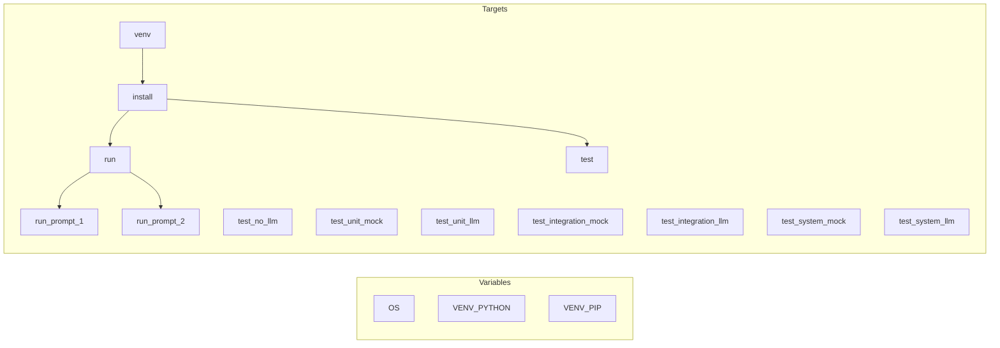

# План: Makefile для venv, залежностей, бота та тестів

## Мета

Один Makefile у корені проєкту [support-wather-agent](.), який:

- визначає шляхи до venv залежно від ОС (Windows vs Unix/Linux/macOS);
- надає цілі для створення venv, встановлення залежностей, запуску бота з `PROMPT_VERSION`, запуску тестів по рівнях і всіх тестів.

---

## 1. Визначення ОС та шляхів venv

- Використати змінну середовища `OS` або визначення через `uname` (на Windows часто встановлено `OS=Windows_NT`; на macOS/Linux — `uname` дасть Darwin/Linux).
- Визначити дві змінні:
  - **VENV_BIN** — каталог з виконуваними файлами venv: `venv/bin` (Unix) або `venv/Scripts` (Windows).
  - **PYTHON** — повний шлях до інтерпретатора: `$(VENV_BIN)/python` (Unix) або `venv\Scripts\python.exe` (Windows). Для Windows у Makefile краще використовувати прямі слеші або один варіант, щоб не плутати з backslash.
- Приклад логіки (псевдокод):
  - Якщо `OS=Windows_NT` (або `ComSpec` задано) → Windows: `VENV_PYTHON = venv/Scripts/python.exe`, `VENV_PIP = venv/Scripts/pip.exe`.
  - Інакше → Unix: `VENV_PYTHON = venv/bin/python`, `VENV_PIP = venv/bin/pip`.
- У Makefile це можна зробити через `ifeq ($(OS),Windows_NT)` та присвоєння відповідних шляхів; за замовчуванням вважати Unix, якщо не Windows.

Файл: **Makefile** у корені проєкту (поруч з [main.py](main.py)).

---

## 2. Цілі для venv та залежностей

- **venv** (або **.venv**): створити venv, якщо його ще немає. Команда: `python3 -m venv venv` (або `py -m venv venv` на Windows, якщо потрібно — можна винести в змінну). Перевірка на наявність: якщо `$(VENV_PYTHON)` існує, не виконувати створення (або завжди викликати venv — idempotent).
- **install** або **deps**: залежить від **venv**; викликати `$(VENV_PIP) install -r requirements.txt` та `$(VENV_PIP) install -e ".[dev]"`, щоб мати і основні, і тестові залежності.
- **install-prod**: лише `$(VENV_PIP) install -r requirements.txt` (без dev), якщо потрібен окремий варіант для продакшену.

Усі подальші цілі (run, test-*) мають використовувати **$(VENV_PYTHON)**, щоб виконувати код у контексті venv без ручної активації.

---

## 3. Запуск бота з версією промпта

- **run**: запуск `$(VENV_PYTHON) main.py`. Передати **PROMPT_VERSION** через середовище: наприклад `export PROMPT_VERSION ?= 2` у Makefile і при запуску `run` викликати `$(VENV_PYTHON) main.py` (змінна вже експортована).
- **run-prompt-1**, **run-prompt-2**: зручні ярлики: запуск з `PROMPT_VERSION=1` та `PROMPT_VERSION=2` відповідно (через `env PROMPT_VERSION=1 $(VENV_PYTHON) main.py` або окремий рецепт з export у підшеллі).

Приклад:

```make
PROMPT_VERSION ?= 2
run: venv
	$(VENV_PYTHON) main.py
run-prompt-1: venv
	PROMPT_VERSION=1 $(VENV_PYTHON) main.py
run-prompt-2: venv
	PROMPT_VERSION=2 $(VENV_PYTHON) main.py
```

(перед run можна експортувати PROMPT_VERSION у рецепті, щоб [config.py](src/weather_agent/config.py) бачив значення.)

---

## 4. Запуск тестів за рівнями

Усі тестові цілі залежать від **venv** (або **install**), викликають pytest через **$(VENV_PYTHON) -m pytest**.

- **test-unit-mock**: `$(VENV_PYTHON) -m pytest tests/UnitMock/ -v`
- **test-unit-llm**: `$(VENV_PYTHON) -m pytest tests/UnitLLM/ -v`
- **test-integration-mock**: `$(VENV_PYTHON) -m pytest tests/IntegrationMock/ -v`
- **test-integration-llm**: `$(VENV_PYTHON) -m pytest tests/IntegrationLLM/ -v` (потребує OPENAI_API_KEY)
- **test-system-mock**: `$(VENV_PYTHON) -m pytest tests/SystemMock/ -v`
- **test-system-llm**: `$(VENV_PYTHON) -m pytest tests/SystemLLM/ -v` (потребує OPENAI_API_KEY)

Додатково:

- **test-no-llm** (або **test-ci**): запуск усіх тестів, що не потребують реального LLM — тобто UnitMock, UnitLLM, IntegrationMock, SystemMock (як у README). Одна команда pytest з кількома шляхами.
- **test**: запуск усіх тестів — `$(VENV_PYTHON) -m pytest tests/ -v`. При відсутності OPENAI_API_KEY частина тестів (IntegrationLLM, SystemLLM) пропуститься за skip.

Опційно додати **test-coverage**: `pytest ... --cov=src/weather_agent --cov-report=term-missing` для звіту покриття.

---

## 5. Додаткові корисні цілі

- **help** (або **default target**): вивід списку доступних цілей та короткого опису (наприклад `@echo "Targets: venv, install, run, run-prompt-1, run-prompt-2, test, test-no-llm, test-unit-mock, ..."`). Можна зробити першою ціллю по замовчуванню.
- **clean**: видалити `venv/`, `__pycache__/`, `.pytest_cache/`, `*.pyc` тощо (опційно).

---

## 6. Структура Makefile (підсумок)




- Блок змінних на початку файлу (OS, VENV_PYTHON, VENV_PIP).
- Цілі: **venv**, **install**, **run**, **run-prompt-1**, **run-prompt-2**, **test**, **test-no-llm**, **test-unit-mock**, **test-unit-llm**, **test-integration-mock**, **test-integration-llm**, **test-system-mock**, **test-system-llm**; опційно **test-coverage**, **clean**, **help**.

---

## 7. Важливі деталі

- **Сумісність з Windows**: у Make (наприклад GNU Make на Windows) команди виконуються в sh за замовчуванням; якщо Make встановлено в Unix-середовищі (WSL, Git Bash), шляхи `venv/bin/python` працюють. Для нативного Windows Make потрібні шляхи з `venv\Scripts\python.exe`. План передбачає обидва варіанти через умову по `OS`.
- **Вибір python для створення venv**: на Unix — `python3 -m venv venv`, на Windows часто `py -m venv venv` або `python -m venv venv`; можна використати одну змінну **PY** (наприклад `python3` за замовчуванням) і в рецепті venv викликати `$(PY) -m venv venv`.
- Не змінювати [README.md](README.md) обовʼязково; якщо потрібно, додати один розділ «Make» з прикладами `make install`, `make run`, `make test-no-llm`.

Після підтвердження плану можна створити один файл **Makefile** у корені проєкту з усіма переліченими цілями та логікою для ОС.