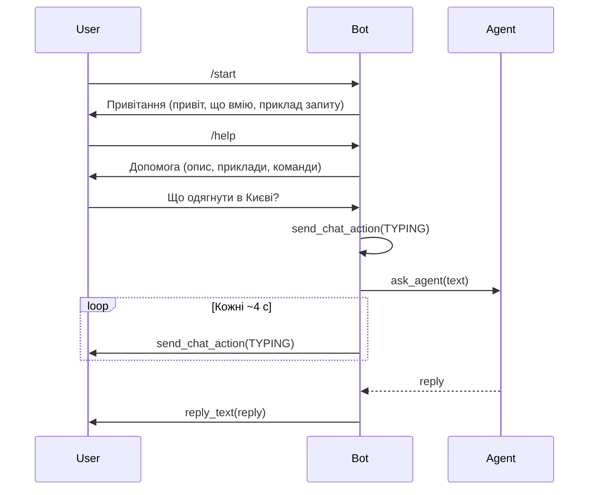

# План: команди, промпти та UX бота

## 1. Команди /start та /help у боті

**Файл:** [src/weather_agent/bot.py](src/weather_agent/bot.py)

- Додати імпорт `CommandHandler` з `telegram.ext`.
- Реалізувати два async-обробники:
  - **start(update, context)** — відправляє привітальне повідомлення (див. п. 2) через `update.message.reply_text(...)`.
  - **help_command(update, context)** — відправляє короткий текст допомоги: що робить бот, приклади запитів («Що одягнути в Києві?», «Як одягнутися у Львові?»), згадка про команди `/start` та `/help`.
- У `build_application` зареєструвати обидва обробники:
  - `CommandHandler("start", start)`
  - `CommandHandler("help", help_command)`
- Порядок: спочатку команди, потім `MessageHandler` для звичайного тексту, щоб команди не потрапляли в агента.

Тексти привітання та допомоги доцільно зберігати в одному місці (константи у `bot.py` або окремому модулі текстів), щоб їх було легко змінювати.

---

## 2. Привітальне повідомлення при початку спілкування

- Використати команду **/start** як момент «початку спілкування»: при виклику `/start` користувач отримує привітання.
- Текст привітання — дружній, українською, 1–3 речення: хто бот, що вміє (порадити, що одягнути за погодою), заклик написати місто або запит. Наприклад: «Привіт! Я допоможу підібрати одяг за погодою. Напиши місто або запитай, наприклад: Що одягнути в Києві?»
- Цей же текст використовувати в обробнику `start` у [bot.py](src/weather_agent/bot.py).

---

## 3. Індикатор очікування відповіді (typing)

**Файл:** [src/weather_agent/bot.py](src/weather_agent/bot.py)

- Під час обробки повідомлення (поки виконується агент) показувати користувачу, що бот «друкує».
- У `handle_message`:
  1. Одразу після перевірки `update.message` та `chat_id` викликати `await context.bot.send_chat_action(chat_id=chat_id, action=ChatAction.TYPING)`.
  2. Оскільки відповідь може формуватися довго, **повторювати** `send_chat_action(..., action=ChatAction.TYPING)` кожні ~4 секунди, поки виконується `asyncio.to_thread(ask_agent, user_text)`. Це можна зробити так:
    - Запустити фонову задачу (asyncio.create_task), яка в циклі кожні 4 с викликає `send_chat_action` і перевіряє, чи вже є результат (наприклад, через asyncio.Event або shared future).
    - Або простіший варіант: один виклик `send_chat_action` перед `asyncio.to_thread` і один одразу після — мінімальний варіант; для кращого UX бажано періодично оновлювати typing поки агент працює.
  3. Після отримання `reply` від агента припинити оновлення typing і відправити `update.message.reply_text(reply)`.

**Імпорт:** `from telegram.constants import ChatAction` (або еквівалент у вашій версії python-telegram-bot).

Якщо в бібліотеці константа називається інакше (наприклад, `ChatAction.TYPING`), використати її з офіційної документації python-telegram-bot.

---

## 4. Системні промпти окремо з версіонуванням

**Нова структура:**

```
src/weather_agent/
  prompts/
    __init__.py
    system_prompt_v1.txt   # поточний текст (лаконічний помічник)
    system_prompt_v2.txt   # нова версія з більшою теплістю/позитивом (див. п. 5)
```

**Логіка версіонування:**

- У [config.py](src/weather_agent/config.py) додати змінну середовища, наприклад `PROMPT_VERSION` (за замовчуванням `"2"` або `"1"`), і функцію/змінну, що повертає активну версію (рядок або int).
- У `prompts/__init__.py` або новому модулі `prompts/loader.py`: функція `get_system_prompt(version: str | None = None) -> str`, яка:
  - Читає змінну версії з config (якщо `version` не передано).
  - Визначає ім’я файлу за шаблоном `system_prompt_v{version}.txt` у каталозі `prompts` (шлях через `Path(__file__).resolve().parent`).
  - Повертає вміст файлу як рядок; якщо файл відсутній — fallback на попередню версію або на вбудований рядок у коді.
- У [agent.py](src/weather_agent/agent.py): при створенні агента не використовувати константу `SYSTEM_PROMPT`, а викликати `get_system_prompt()` і передавати результат у `create_agent(..., system_prompt=...)`.

**Альтернатива без env:** жорстко задати в коді `DEFAULT_PROMPT_VERSION = "2"` і змінювати при потребі; версіонування залишиться через імена файлів (`system_prompt_v1.txt`, `system_prompt_v2.txt`).

---

## 5. Більше тепла та позитиву у відповідях

- Оновити **системний промпт** так, щоб модель відповідала тепліше й позитивніше: дружній тон, підтримка, можливо короткі підбадьорливання (наприклад, «Гарного дня!», «Бережи себе в таку погоду»), без сухого переліку.
- Рекомендований варіант — це **нова версія промпту** у файлі `prompts/system_prompt_v2.txt`:
  - Зберегти поточну логіку: відповідати українською, спочатку викликати `get_weather` для міста, потім давати рекомендацію по одягу.
  - Додати інструкції на кшталт: «Пиши тепло й по-дружньому; в кінці можна додати коротке побажання (наприклад гарного дня або поради берегти себе); уникай сухого тону.»

Поточний текст з [agent.py](src/weather_agent/agent.py) перенести в `prompts/system_prompt_v1.txt`. За замовчуванням використовувати v2 (або v1, якщо змінна `PROMPT_VERSION` не задана і за замовчуванням залишиться 1 — тоді в config за замовчуванням поставити `"2"` після додавання v2).

---

## 6. Підсумок змін по файлах


| Файл                                                       | Дія                                                                                                                                                                                                      |
| ---------------------------------------------------------- | -------------------------------------------------------------------------------------------------------------------------------------------------------------------------------------------------------- |
| [src/weather_agent/bot.py](src/weather_agent/bot.py)       | Додати CommandHandler для /start, /help; тексти привітання та допомоги; у handle_message — send_chat_action(TYPING) до та (опційно) періодично під час виклику агента; reply_text після отримання reply. |
| [src/weather_agent/agent.py](src/weather_agent/agent.py)   | Видалити константу SYSTEM_PROMPT; імпортувати get_system_prompt з prompts; у _get_agent викликати get_system_prompt() і передавати в create_agent.                                                       |
| [src/weather_agent/config.py](src/weather_agent/config.py) | Додати PROMPT_VERSION (наприклад, за замовчуванням "2").                                                                                                                                                 |
| src/weather_agent/prompts/                                 | Нова директорія: **init**.py (експорт get_system_prompt або логіка завантаження), system_prompt_v1.txt, system_prompt_v2.txt.                                                                            |


---

## 7. Діаграма потоку повідомлення




Після реалізації плану варто перевірити: виклик /start та /help, надходження typing під час довгого запиту та тон відповіді з системним промптом v2.