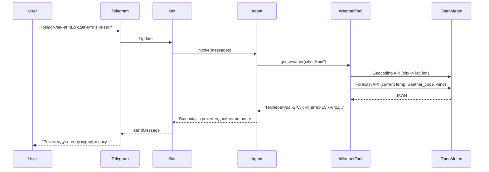

# План: Агент "Що одягнути" у Telegram

## Архітектура




- **Вхід**: текст від користувача в Telegram (наприклад, "Що одягнути в Києві?", "Як одягнутися сьогодні у Львові?").
- **Агент** (LangChain) отримує повідомлення, при потребі викликає tool `get_weather`, і формує відповідь українською.
- **Tool** використовує лише Open-Meteo: Geocoding (місто → координати), потім [Forecast API](https://open-meteo.com/en/docs) для поточних умов.

## Структура проєкту

Рекомендована структура (мінімальна, один пакет):

```
support-wather-agent/
├── pyproject.toml          # або requirements.txt
├── .env.example
├── README.md
├── src/
│   └── weather_agent/
│       ├── __init__.py
│       ├── config.py       # завантаження змінних середовища
│       ├── weather.py      # Open-Meteo клієнт + tool get_weather
│       ├── agent.py        # створення LangChain-агента з tool
│       └── bot.py          # Telegram long polling, обробник повідомлень
└── main.py                 # точка входу: запуск бота
```

Альтернатива без `src/`: всі модулі в корені (`weather.py`, `agent.py`, `bot.py`, `main.py`).

## Крок 1: Залежності

- **LangChain**: `langchain`, `langchain-openai` або `langchain-anthropic` (залежно від обраної моделі).
- **Telegram**: `python-telegram-bot` (v21+ async).
- **HTTP**: `httpx` або `requests` для Open-Meteo.
- **Конфіг**: `python-dotenv`.

Файл залежностей: `requirements.txt` або в `pyproject.toml` (optional).

## Крок 2: Tool погоди (Open-Meteo)

**Файл**: `weather.py` (або `src/weather_agent/weather.py`).

- **Geocoding**: `GET https://geocoding-api.open-meteo.com/v1/search?name={city}&count=1` — отримати `latitude`, `longitude`, `timezone` для першого результату. Якщо результатів немає — повернути зрозуміле повідомлення про помилку.
- **Forecast**: `GET https://api.open-meteo.com/v1/forecast` з параметрами:
  - `latitude`, `longitude` з geocoding;
  - `current`: `temperature_2m`, `relative_humidity_2m`, `weather_code`, `wind_speed_10m`, опційно `apparent_temperature`;
  - `timezone` — з geocoding (наприклад `Europe/Kyiv`).

Tool для агента (сигнатура та опис важливі для LLM):

```python
from langchain.tools import tool

@tool
def get_weather(city: str) -> str:
    """Отримати поточну погоду для міста (назва українською або англійською). Використовуй для рекомендацій що одягнути."""
    # 1) Geocoding API -> lat, lon, timezone
    # 2) Forecast API -> current temp, weather_code, wind_speed_10m
    # 3) Перетворити weather_code в текст (WMO: 0=clear, 71–77=snow, 61–67=rain, тощо)
    # 4) Повернути короткий текст українською: температура, умови, вітер
```

Реалізація: один клас або функції без збереження стану; виклики через `httpx.get` з таймаутом. Маппінг WMO кодів (0, 1–3, 45, 48, 51–67, 71–77, 80–86, 95–99) на короткі описи українською можна винести у словник у тому ж файлі.

## Крок 3: Агент LangChain

**Файл**: `agent.py`.

- Імпорт: `create_agent` з `langchain.agents`, `get_weather` з `weather`.
- Модель: через змінну середовища (наприклад `OPENAI_API_KEY` + `gpt-4o-mini` або `ANTHROPIC_API_KEY` + модель Anthropic). Один варіант за замовчуванням достатньо для простого агента.
- System prompt (українською): роль "помічник, який радить що одягнути за погодою"; інструкція завжди викликати `get_weather` для міста перед порадою; відповідати коротко й по-українськи.
- Створення: `create_agent(model=..., tools=[get_weather], system_prompt=...)`.
- Функція-обгортка для бота: приймає текст користувача, викликає `agent.invoke({"messages": [HumanMessage(content=...)]]})`, повертає текст останнього повідомлення з `result["messages"]` (або обробляє помилку й повертає повідомлення про збій).

Конфіг (API keys, назва моделі) читати з `config.py` (env vars через `os.getenv` або `python-dotenv`).

## Крок 4: Telegram-бот

**Файл**: `bot.py`.

- Використати `python-telegram-bot` (async): `Application.builder().token(...).build()`.
- Один handler на текстові повідомлення: при отриманні `message.text` викликати агента (крок 3), отриману відповідь відправити в чат через `message.reply_text(...)`. Якщо агент кидає виключення — відповісти користувачу коротким повідомленням про помилку.
- Токен бота зі змінної середовища `TELEGRAM_BOT_TOKEN`.

**Файл**: `main.py`.

- Завантажити `.env` (python-dotenv).
- Перевірити наявність `TELEGRAM_BOT_TOKEN` (і ключа для LLM).
- Запустити бота через `Application.run_polling()`.

## Крок 5: Конфігурація та документація

- `**.env.example**`: `TELEGRAM_BOT_TOKEN=`, `OPENAI_API_KEY=` (або `ANTHROPIC_API_KEY=`), опційно `DEFAULT_MODEL=...`.
- **README.md**: опис проєкту; як отримати токен Telegram (@BotFather) та API-ключ; встановлення залежностей; запуск `main.py`; приклад запитів ("Що одягнути в Києві?").

## Важливі деталі

- **Мова**: системний промпт і відповіді агента — українською; опис tool та повернення з tool теж українською, щоб агент стабільніше давав поради.
- **Помилки**: у tool при збої Geocoding/Forecast повертати текст помилки (без падіння), щоб агент міг сказати "не вдалося отримати погоду для X".
- **Безпека**: токени лише з env, не комітити `.env`.
- **Open-Meteo**: без API-ключа для некомерційного використання; Geocoding та Forecast — публічні endpoints.

## Можливі подальші покращення (поза поточним планом)

- Збереження міста за замовчуванням для користувача (наприклад, через `/set_city Київ`).
- Підтримка координат у повідомленні (опційно в tool).
- Логування запитів/відповідей для налагодження.

Після підтвердження плану можна переходити до реалізації по кроках (залежності → weather tool → agent → bot → main + config + README).